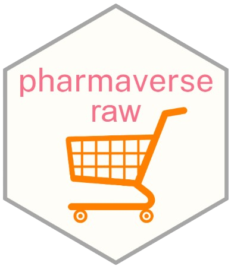

# pharmaverseraw 

<!-- badges: start -->

<!-- [](https://pharmaverse.org) [](https://github.com/pharmaverse/pharmaversesdtm/actions/workflows/code-coverage.yml)-->

<!-- badges: end -->

Raw data for domains in the `pharmaversesdtm` package

-   [Purpose](#purpose)
-   [Installation](#installation)
-   [Data Sources](#data-sources)
-   [Naming Conventions](#naming)
-   [How To Update](#how-to-update)

# Purpose {#purpose}

To provide raw datasets which can be used to generate SDTM datsets in the `pharmaversesdtm` package.

# Installation {#installation}

The package is available from CRAN and can be installed by running `install.packages("pharmaverseraw")`. To install the latest development version of the package directly from GitHub use the following code:

``` r
if (!requireNamespace("remotes", quietly = TRUE)) {
  install.packages("remotes")
}

remotes::install_github("pharmaverse/pharmaverseraw", ref = "main") # This command installs the latest development version directly from GitHub.
```

# Data Sources {#data-sources}

Raw datasets are created based upon the SDTM domains in `pharmaversesdtm` package.

# Naming Conventions {#naming}

Datasets are named following the associated SDTM domain names with a "_raw" appended.
For example, the raw data used to create subject disposition `DS` domain
is named as "ds_raw".

# How To Update {#how-to-update}

Firstly, make a GitHub issue in [`{pharmaverseraw}`](https://github.com/pharmaverse/pharmaverseraw) with the planned updates and tag `@pharmaverse/admiral` so that one of the development core team can sanity check the request. Then there are two main ways to extend the test data: either by adding new datasets or extending existing datasets with new records/variables. Whichever method you choose, it is worth noting the following:

-   Programs that generate raw data are stored in the `data-raw/` folder.
-   Each of these programs is written as a standalone R script: if any packages need to be loaded for a given program, then call `library()` at the start of the program (but please do **not** call `library(pharmaverseraw)`).
-   When you have created a program in the `data-raw/` folder, you need to run it as a standalone R script, in order to generate a raw dataset that will become part of the `{pharmaverseraw}` package, but you do not need to build the package.
-   Following [best practice](https://r-pkgs.org/data.html#sec-data-data), each dataset is stored as a `.rda` file whose name is consistent with the name of the dataset, e.g., dataset `xx_raw` is stored as `xx_raw.rda`. The easiest way to achieve this is to use `usethis::use_data(xx_raw)`
-   The programs in `data-raw/` are stored within the `{pharmaverseraw}` GitHub repository, but they are **not** part of the `{pharmaverseraw}` package--the `data-raw/` folder is specified in `.Rbuildignore`.
-   When you run a program that is in the `data-raw/` folder, you generate a dataset that is written to the `data/` folder, which will become part of the `{pharmaverseraw}` package.
-   The names and sources of raw datasets are specified in `R/*.R`, for the purpose of generating documentation in the `man/` folder.

### Adding New Raw Datasets

-   Create a program in the `data-raw/` folder, named `<name>.R`, where `<name>` should follow the [naming convention](#naming), to generate the raw data and output `<name>.rda` to the `data/` folder.
    -   Note that **no personal data should be used** as part of this package, even if anonymized.
-   Run the program.
-   Reflect this update by documenting the dataset in the `R/*.R` file.
-   Run `devtools::document()` in order to update `NAMESPACE` and update the `.Rd` files in `man/`.
-   Add your GitHub handle to `.github/CODEOWNERS`.
-   Update `NEWS.md`.

### Updating Existing SDTM Datasets

-   Locate the existing program `<name>.R` in the `data-raw/` folder, update it accordingly.
-   Reflect this update by updating the corresponding script in the `R/*.R` file.
-   Run the program, and output updated `<name>.rda` to the `data/` folder.
-   Run `devtools::document()` in order to update `NAMESPACE` and update the `.Rd` files in `man/`.
-   Add your GitHub handle to `.github/CODEOWNERS`.
-   Update `NEWS.md`.
